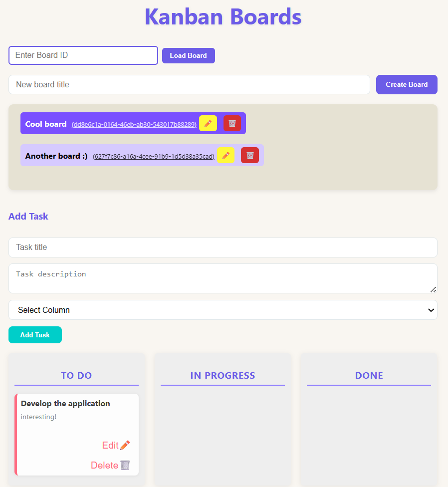

I built a Kanban board app where anyone can create, update, and delete their own boards. Each board has a unique hashed ID and a name, and comes with three default columns: ToDo, In Progress, and Done. Visitors can enter a board ID to load the specific board along with its columns and cards, if it exists. Users can easily add, edit, or delete cards — each with a title and description. Plus, I implemented smooth drag-and-drop functionality so cards can be moved between columns or reordered effortlessly, making task management intuitive and flexible.

How to use:

To create a board, simply enter its name and click the "Create Board" button. Once created, the board’s name and its unique ID will appear. Click on the ID — it will automatically fill the "Enter Board ID" field. Then press the "Load" button to open the board. Loading can take a while, because of Render (please be patient). Additionally, you can edit/delete board.

Below, you’ll see options to add a task by entering its title and description. Click "Add Task" to add it to the column. The new task will appear in the column immediately. You can easily drag and drop tasks between columns to rearrange or move them. Plus, tasks can be edited or deleted at any time.

I hope you will like it ❤️

